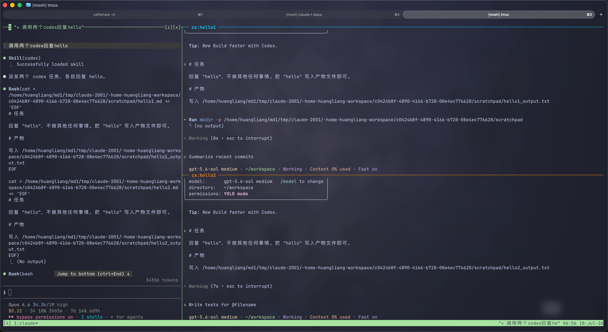

# cc-codex-tmux

A [Claude Code](https://docs.anthropic.com/en/docs/claude-code) skill that dispatches tasks to [OpenAI Codex CLI](https://github.com/openai/codex) inside tmux panes — giving you a visible, interactive TUI while Claude Code's main session stays unblocked.



## Why

Claude Code can delegate sub-tasks to Codex CLI. Without this skill, delegation means either:

- **Blocking** the main session while Codex works, or
- **Running blind** via `codex exec` with no visibility.

`codex-tmux` gives you the best of both worlds: tasks run in dedicated tmux panes with full TUI access (you can watch progress, intervene mid-task), while the main Claude Code session continues working. When Codex finishes, the main session is notified and picks up the result.

## Features

- **Visual tmux panes** — Real Codex TUI in a split pane; agent-team-style layout with colored borders and pinned titles (`cx:<task>`, turning `✅` on completion).
- **Non-blocking** — Runs via `run_in_background`; exits on first-turn completion to wake the caller.
- **Parallel dispatch** — Spin up N independent tasks in one batch; each gets its own pane, title, and report path.
- **Resume** — Continue a previous Codex session with `--resume <session-id|last>`.
- **Pane management** — `list` / `kill <name|%id|done|all>` commands with a registry that auto-prunes dead panes.
- **Prompt-proof for unattended runs** — Default bypass posture kills approval/trust dialogs at the root: launches with `--dangerously-bypass-approvals-and-sandbox` (plus `--dangerously-bypass-hook-trust` when the CLI supports it) and pre-trusts the working directory inline via `-c`, so panes don't hang on interactive dialogs.
- **Graceful degradation** — No tmux? Falls back to `codex exec` (headless) with identical `-o` semantics.
- **Notify integration** — Uses Codex's official notify callback to capture the final response and session ID.
- **Zero install** — Pure bash script; no build step, no package manager.

## Requirements

- bash ≥ 4.4
- tmux ≥ 3.2
- [Codex CLI](https://github.com/openai/codex) (`codex` in PATH)
- GNU coreutils
- One of: jq / node / python3 (for extracting the final report from notify JSON; all absent = raw JSON pointer, flow unaffected)

## Installation

### As a Claude Code skill (recommended)

```bash
# Clone into your Claude Code skills directory
git clone git@github.com:huanglune/cc-codex-tmux.git ~/.claude/skills/codex
```

Claude Code will automatically discover `SKILL.md` and make the `/codex` slash command available.

### Standalone

```bash
git clone git@github.com:huanglune/cc-codex-tmux.git
# Optionally symlink into PATH:
ln -s "$PWD/cc-codex-tmux/scripts/codex-tmux" ~/.local/bin/codex-tmux
```

## Usage

### Dispatch a new task

```bash
codex-tmux -t <task-name> -o <report-path> -C <workdir> --brief <brief-file> \
    -- -c 'model_reasoning_effort="max"'
```

| Flag | Description |
|------|-------------|
| `-t TITLE` | Pane title (defaults to report filename stem) |
| `-o REPORT` | Final report output path (**required**) |
| `-C DIR` | Codex working directory (default: `$PWD`) |
| `--brief FILE` | Task brief file; omit to read from stdin |
| `--resume ID` | Resume a previous session (`ID` or `last`) |
| `-w` | Use a separate tmux window instead of a split pane |
| `--close` | Close the pane on completion (default: keep for follow-up; set `CODEX_TMUX_CLOSE_DONE=1` to make this the global default) |
| `--timeout S` | Max wait seconds (0 = unlimited); exits 124 on timeout |
| `-- ...` | Extra flags passed directly to `codex` (after `--`) |

### Resume a session

```bash
codex-tmux --resume <session-id|last> -t <task-name> -o <new-report> \
    --brief <follow-up-file> -- -c 'model_reasoning_effort="max"'
```

Session ID is printed at the bottom of each report. Omit `-C` to reuse the original session's working directory; the script recovers it from the session rollout and passes it to Codex explicitly, avoiding an unattended directory-selection prompt.

### Pane management

```bash
codex-tmux list                   # Show all registered panes (status, location, report)
codex-tmux kill <name>            # Kill a specific task's pane
codex-tmux kill %42               # Kill by pane ID
codex-tmux kill done              # Kill all completed panes
codex-tmux kill all               # Kill everything
```

Panes are **kept after completion by default** (so you can resume in-pane) — this is intended, not a leak. To clean them up: run `codex-tmux kill done` after reading reports, pass `--close` per-dispatch, or `export CODEX_TMUX_CLOSE_DONE=1` to auto-close globally. Closing a pane never breaks `--resume` (session state lives on disk, looked up by session ID).

## Environment Variables

| Variable | Default | Description |
|----------|---------|-------------|
| `CODEX_TMUX_MODE` | `pane` | `pane` / `window` / `exec` |
| `CODEX_TMUX_PANE_WIDTH` | `70%` | Width of the first Codex pane split |
| `CODEX_TMUX_MAIN_WIDTH` | `30%` | Main pane width when >2 panes trigger `main-vertical` |
| `CODEX_TMUX_LAYOUT` | `main-vertical` | `main-vertical` / `none` |
| `CODEX_TMUX_BYPASS` | `1` | `1` = `--dangerously-bypass-approvals-and-sandbox`; `0` = default Codex approval flow |
| `CODEX_TMUX_CLOSE_DONE` | `0` | `1` = auto-close the pane on completion (global default for `--close`); resume is unaffected |
| `CODEX_HOME` | `~/.codex` | Session lookup directory |

## Report Format

The report file (`-o`) contains:

1. Codex's final assistant message (extracted from notify JSON)
2. A metadata footer:
   ```
   ---
   [codex-tmux] 完成 2026-07-18 12:34:56  pane=%19
   [codex-tmux] session-id: 019f7583-...
   [codex-tmux] rollout: ~/.codex/sessions/2026/07/18/rollout-....jsonl
   [codex-tmux] 续聊: codex-tmux --resume <id> -t <name> -o <report> --brief <file>
   ```

Auxiliary files in the same directory: `.brief`, `.launch.sh`, `.notify.sh`, `.notify.json`, `.done`, `.pane.log`, `.stamp`.

## Exit Codes

| Code | Meaning |
|------|---------|
| 0 | Task completed successfully |
| 2 | Pane died before completion (see `.pane.log`) |
| 124 | Timeout reached; Codex still running in the pane |

## How It Works

```
Claude Code main session
  │
  ├── writes task brief to file
  ├── calls: codex-tmux -t foo -o report.md --brief brief.md -- ...
  │     │
  │     ├── splits a tmux pane (agent-team layout)
  │     ├── launches real Codex TUI with the brief as first prompt
  │     ├── configures notify callback → writes .notify.json + .done
  │     └── polls for .done, then extracts report and exits
  │
  └── (run_in_background) ← wakes up here, reads report.md
```

## Sandbox Note

By default, `CODEX_TMUX_BYPASS=1` passes `--dangerously-bypass-approvals-and-sandbox` to Codex. This is designed for isolated environments (containers, VMs) where bubblewrap can't run.

For shared or production machines, set `CODEX_TMUX_BYPASS=0` — Codex will use its normal approval flow, and you can interact with approval prompts directly in the tmux pane.

## Suppressing Interactive Prompts

Codex TUI dialogs can stall an unattended pane. By default `codex-tmux` suppresses approval/trust dialogs at the root (bypass flags + inline pre-trust of the working directory — no flags needed; with `CODEX_TMUX_BYPASS=0` you answer prompts in the pane yourself). The remaining prompts are Codex-level nudges best silenced once in `~/.codex/config.toml` — this is your own machine-level config (keep your provider/`base_url` there private; never commit it):

```toml
check_for_update_on_startup = false      # startup update-check prompt

[notice]
hide_rate_limit_model_nudge = true       # "switch model?" nudge on rate limits
hide_full_access_warning = true          # full-access warning under bypass sandbox
```

For a task that needs no visibility at all, `CODEX_TMUX_MODE=exec` runs headless (`codex exec`), which cannot prompt by construction.

## License

MIT
